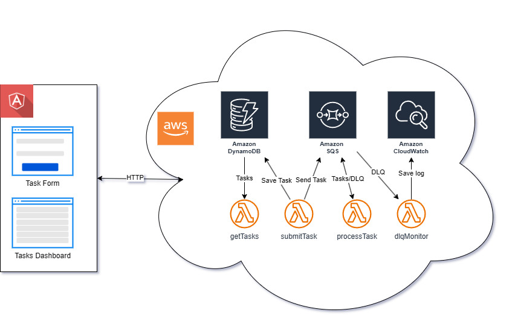

# Fault-Tolerant System (SQS + Lambda + DynamoDB)

## Pre-requisites

- AWS CLI installed and configured
- Node.js 20.x installed
- Serverless Framework installed (v3.x, **NOT v4.x**)

## Architecture



## Configuration

- Create an `.env` file in `server` folder by copying `.env.example` and filling in the required values.
  By default, it uses the `eu-central-1` region:

```dotenv
AWS_REGION=eu-central-1
AWS_STAGE=dev
```

## Deploying the Infrastructure

- Install the dependencies for both frontend and backend applications:

```bash
npm install
```

- Run the following command to deploy the infrastructure:

```bash
./deploy.sh
```

**OR**

```bash
npm run deploy
```

- This will deploy the following resources:
  - SQS Queue
  - Lambda Function
  - DynamoDB Table
  - IAM Roles and Policies
  - API Gateway
- And also:
  - Builds the frontend
  - Assigns Gateway URL to the frontend

## Running the Application Locally

- To run the frontend application locally, run the following command:

```bash
npm run start
```

## Unit tests

Both the frontend and backend applications have unit tests written using jest.

- For the frontend application, run the following command:

```bash
npm run test:client
```

- For the backend application, run the following command:

```bash
npm run test:server
```
